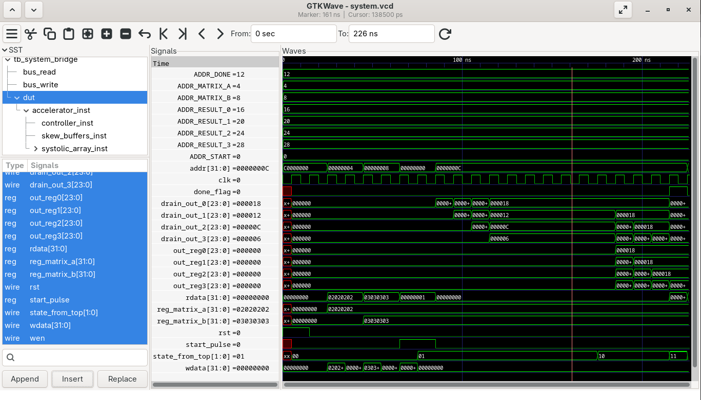

# 4x4 Matrix RISC-V Systolic Array Accelerator

This repository contains a small 4x4 output-stationary systolic array accelerator written in synthesizable Verilog. The design is organized as reusable RTL blocks with standalone SystemVerilog testbenches.

## Architecture

The accelerator is built around a 4x4 grid of processing elements (PEs). Each PE accepts an 8-bit `a_in`, an 8-bit `b_in`, and a 24-bit vertical accumulation input. During compute mode, each PE accumulates:

```verilog
acc <= acc + (a_in * b_in);
```

Matrix A values move horizontally across each row, while Matrix B values move vertically down each column. The accumulator path shifts vertically during drain mode so results can be read from the bottom of the array.

The main RTL blocks are:

- `pe_output_stationary.v`: single output-stationary processing element.
- `systolic_array_4x4.v`: structural 4x4 PE grid.
- `data_skew_buffers.v`: staircase input delays for rows and columns.
- `array_controller.v`: FSM controlling compute, drain, accumulator clear, and done signaling.
- `accelerator_top.v`: integrates controller, skew buffers, and systolic array.
- `accelerator_bus_interface.v`: MMIO wrapper for software-visible control and result registers.

## MMIO Interface

The accelerator bus interface exposes 32-bit memory-mapped registers. In the full system map, the accelerator starts at `0x40000000`.

| Address | Access | Description |
| --- | --- | --- |
| `0x40000000` | Write | Start register. Write `1` to launch one operation. |
| `0x40000004` | Read/Write | Matrix A packed 8-bit row inputs. |
| `0x40000008` | Read/Write | Matrix B packed 8-bit column inputs. |
| `0x4000000C` | Read | Done flag in bit 0. |
| `0x40000010` | Read | Result 0, zero-extended from 24 bits. |
| `0x40000014` | Read | Result 1, zero-extended from 24 bits. |
| `0x40000018` | Read | Result 2, zero-extended from 24 bits. |
| `0x4000001C` | Read | Result 3, zero-extended from 24 bits. |

## Simulation

Run the bridge-level simulation with Icarus Verilog:

```bash
iverilog -g2012 -o system_sim.vvp tb/tb_system_bridge.sv rtl/*.v
vvp system_sim.vvp
```

The testbench writes matrix input values through the MMIO interface, starts the accelerator, polls the done register, and reads back result 0.

